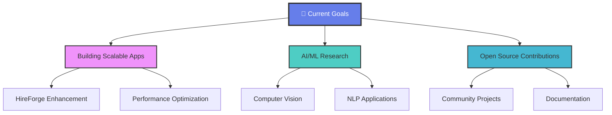

[](https://holopin.io/@hsinha11)

<div align="center">
  


</div>


<div align="center">
  
# 🚀 Full-Stack Engineer & Applied AI Researcher
### *Building the Future, One Line of Code at a Time*

[](https://git.io/typing-svg)

</div>

---

<div align="center">

## 🌌 **Connect & Collaborate**

[](https://www.linkedin.com/in/harianantsinha/)
[](https://github.com/HSinha11)
[](https://x.com/HarianantS)
[](https://harianantsinha.hashnode.dev/)


</div>

---


## 🧠 **About Me**

```typescript
const harianant = {
    role: "Full-Stack Engineer & AI Researcher",
    education: "Computer Science Graduate",
    passion: ["Clean Architecture", "Scalable Solutions", "AI Innovation"],
    currentFocus: "Building production-ready applications",
    philosophy: "Code is poetry, and every bug is a haiku waiting to be fixed",
    
    dailyRoutine: {
        morning: "☕ Coffee + Code Review",
        afternoon: "🔨 Building & Debugging", 
        evening: "📚 Learning New Tech",
        night: "🌙 Open Source Contributions"
    }
};

```

### 🎯 **What Drives Me**
- 🔮 Transforming ideas into elegant, scalable solutions
- 🧪 Experimenting with cutting-edge AI/ML technologies  
- 🌱 Contributing to open-source communities
- 🚀 Optimizing for performance and user experience

---

<div align="center">

## 🏗️ **Featured Projects Portfolio**

</div>

<table>
<tr>
<td width="33%" valign="top">

### 🎯 **HireForge**
*NextGen Job Board Platform*


🔥 **Impact:**
- Architected for **10,000+ users**
- **98/100** Lighthouse Performance
- Microservice-ready architecture

✨ **Features:**
- Real-time job updates
- Secure JWT authentication  
- Advanced search & filtering
- Role-based access control

**🛠️ Stack:** Next.js • TypeScript • PostgreSQL • Prisma • Supabase

[](https://github.com/Hsinha11/HireForge)
[](https://hireforge-new.vercel.app/)

</td>
<td width="33%" valign="top">

### 🤖 **Deepfake Detection AI**
*Advanced Video Analysis System*


🎯 **Achievement:**
- **97.5% accuracy** on benchmarks
- Novel CNN-LSTM architecture
- Research paper submitted

🔬 **Innovation:**
- Multi-dataset validation
- Real-time processing pipeline
- Comprehensive evaluation metrics

**🛠️ Stack:** Python • PyTorch • TensorFlow • Django • OpenCV

[](https://github.com/Hsinha11/Deepfake_detection_using_deep_learning)
[](#)

</td>
<td width="33%" valign="top">

### 📄 **DocuSage**
*AI Document Assistant*


💡 **Innovation:**
- Natural language document queries
- Multi-format text extraction
- Intelligent summarization
- Real-time chat interface

🌟 **Capabilities:**
- PDF & image text extraction
- Google Gemini API integration
- Instant document insights

**🛠️ Stack:** Python • Streamlit • Google Gemini • OCR

[](https://github.com/Hsinha11/DocuSage-AI-Document-Assistant)
[](https://docusage.streamlit.app/)

</td>
</tr>
</table>

---

<div align="center">

## 🛠️ **Technology Arsenal**

</div>

<div align="center">

### **Languages & Core**


### **Frontend Mastery**


### **Backend & Infrastructure**


### **AI/ML & Tools**


</div>

---

<div align="center">

## 📊 **GitHub Analytics**


</div>

---

<div align="center">

## 🏆 **Achievement Gallery**


</div>

---

<div align="center">

## ⚡ **Coding Activity**

[](https://wakatime.com/@05bebc06-1606-4c63-837a-90cc701eec10)

[](https://github.com/anuraghazra/github-readme-stats)

</div>

---

<div align="center">

## 🌟 **Current Focus**


```mermaid
graph TD
    A[🎯 Current Goals] --> B[Building Scalable Apps]
    A --> C[AI/ML Research]
    A --> D[Open Source Contributions]
    
    B --> E[HireForge Enhancement]
    B --> F[Performance Optimization]
    
    C --> G[Computer Vision]
    C --> H[NLP Applications]
    
    D --> I[Community Projects]
    D --> J[Documentation]
    
    style A fill:#667eea,stroke:#333,stroke-width:3px,color:#fff
    style B fill:#f093fb,stroke:#333,stroke-width:2px
    style C fill:#4ecdc4,stroke:#333,stroke-width:2px
    style D fill:#45b7d1,stroke:#333,stroke-width:2px
```

</div>

---

<div align="center">

## 💭 **Philosophy**


*"Exploring the world of technology with passion and curiosity, one commit at a time."*  
— **Harianant Sinha**

---

### 🤝 **Let's Build Something Amazing Together!**

*Open to collaborations, innovative projects, and meaningful conversations about technology.*

[](mailto:harianantsinha2003@gmail.com)

---


</div>
